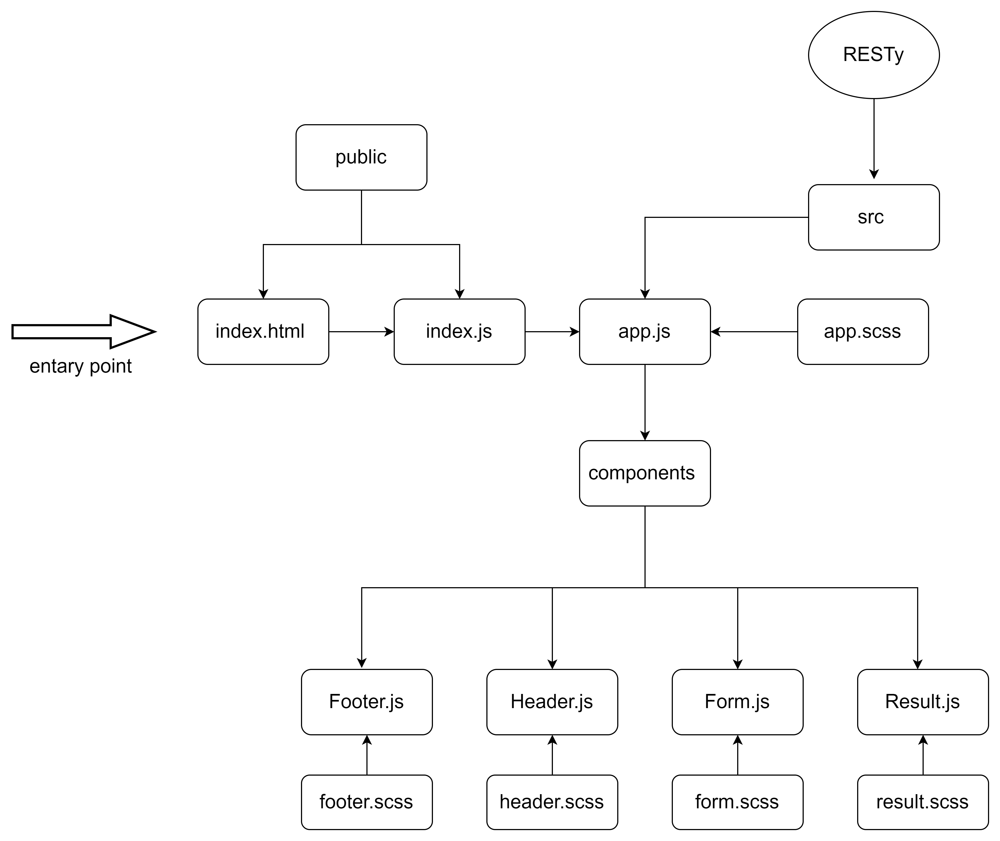

# RESTy

this is a practice projecat for week 6 at asac 401 course

**_RESTy Phase 1_**: Begin work on the RESTy API testing application

### [pull request](https://github.com/hibasalem/resty/pull/2)

### [code sand box](https://codesandbox.io/s/long-worker-8gm41)

---



---

expicted result :

- `any link `

  - get
    ​

  ```
    {
        "count": 2,
        "results": [
            {
            "name": "fake thing 1",
            "url": "http://fakethings.com/1"
            },
            {
            "name": "fake thing 2",
            "url": "http://fakethings.com/2"
            }
        ]
    }
  ​
  ```

---
