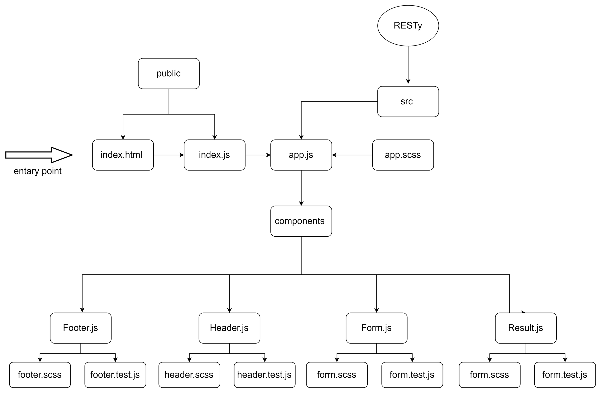
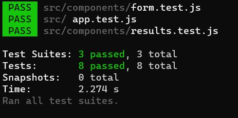

# RESTy

this is a practice projecat for week 6 at asac 401 course

**_RESTy Phase 1_**: Begin work on the RESTy API testing application

**_RESTy Phase 2_**: Retrieving User Input and Managing State

**_RESTy Phase 3_**: Connect RESTy with APIs, running live requests

### [ lab 27 pull request](https://github.com/hibasalem/resty/pull/3)

### [ lab 27 edit pull request](https://github.com/hibasalem/resty/pull/6)

### [ lab 28 pull request](https://github.com/hibasalem/resty/pull/5)

### [lab 27 netlify](https://zealous-blackwell-84329a.netlify.app/)

### [lab 28 netlify](https://resty401.netlify.app/)

---



---

### Tests

- app tests

  - renders the title
  - renders the request mathod and url

- form tests

  - runs a function on button click
  - run a function on url input change
  - changes the methoud and the class of the current method span to active on click

- results test

  - renders the loading spinner
  - renders null for results before subitting Url
  - renders the correct data form the api



---

expicted result :

- `randomURL `

  - `get `or`post`or`put`or` delete`
    ​

  Request Method: `get `or`post`or`put`or` delete`
  URL: `randomURL`

```
  loading sppiner
​
```

- `valid api URL` example : `https://pokeapi.co/api/v2/pokemon`

  - `get `or`post`or`put`or` delete`
    ​

  Request Method: `get `or`post`or`put`or` delete`
  URL: `https://pokeapi.co/api/v2/pokemon`

```

  {
     {
  "count": 1118,
  "next": "https://pokeapi.co/api/v2/pokemon?offset=20&limit=20",
  "previous": null,
  "results": [
    {
      "name": "bulbasaur",
      "url": "https://pokeapi.co/api/v2/pokemon/1/"
    },
    {
      "name": "ivysaur",
      "url": "https://pokeapi.co/api/v2/pokemon/2/"
    },
    {
      "name": "venusaur",
      "url": "https://pokeapi.co/api/v2/pokemon/3/"
    },
    {
      "name": "charmander",
      "url": "https://pokeapi.co/api/v2/pokemon/4/"
    },
    {
      "name": "charmeleon",
      "url": "https://pokeapi.co/api/v2/pokemon/5/"
    },
    {
      "name": "charizard",
      "url": "https://pokeapi.co/api/v2/pokemon/6/"
    },
    {
      "name": "squirtle",
      "url": "https://pokeapi.co/api/v2/pokemon/7/"
    },
    {
      "name": "wartortle",
      "url": "https://pokeapi.co/api/v2/pokemon/8/"
    },
    {
      "name": "blastoise",
      "url": "https://pokeapi.co/api/v2/pokemon/9/"
    },
    {
      "name": "caterpie",
      "url": "https://pokeapi.co/api/v2/pokemon/10/"
    },
    {
      "name": "metapod",
      "url": "https://pokeapi.co/api/v2/pokemon/11/"
    },
    {
      "name": "butterfree",
      "url": "https://pokeapi.co/api/v2/pokemon/12/"
    },
    {
      "name": "weedle",
      "url": "https://pokeapi.co/api/v2/pokemon/13/"
    },
    {
      "name": "kakuna",
      "url": "https://pokeapi.co/api/v2/pokemon/14/"
    },
    {
      "name": "beedrill",
      "url": "https://pokeapi.co/api/v2/pokemon/15/"
    },
    {
      "name": "pidgey",
      "url": "https://pokeapi.co/api/v2/pokemon/16/"
    },
    {
      "name": "pidgeotto",
      "url": "https://pokeapi.co/api/v2/pokemon/17/"
    },
    {
      "name": "pidgeot",
      "url": "https://pokeapi.co/api/v2/pokemon/18/"
    },
    {
      "name": "rattata",
      "url": "https://pokeapi.co/api/v2/pokemon/19/"
    },
    {
      "name": "raticate",
      "url": "https://pokeapi.co/api/v2/pokemon/20/"
    }
  ]
}


```

---
